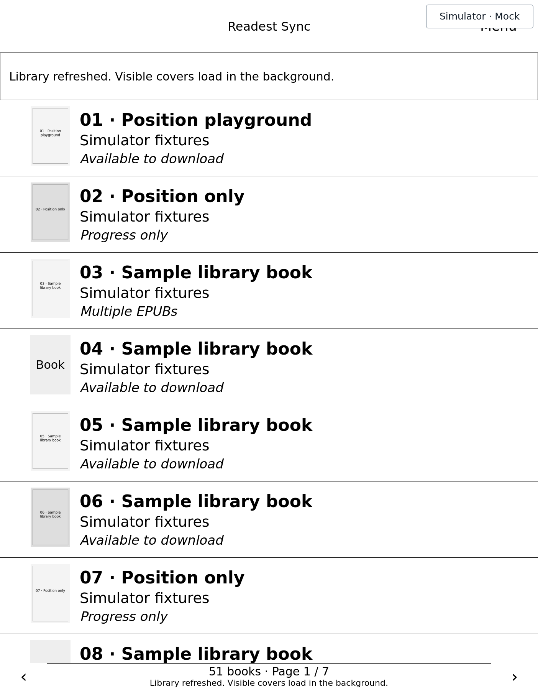
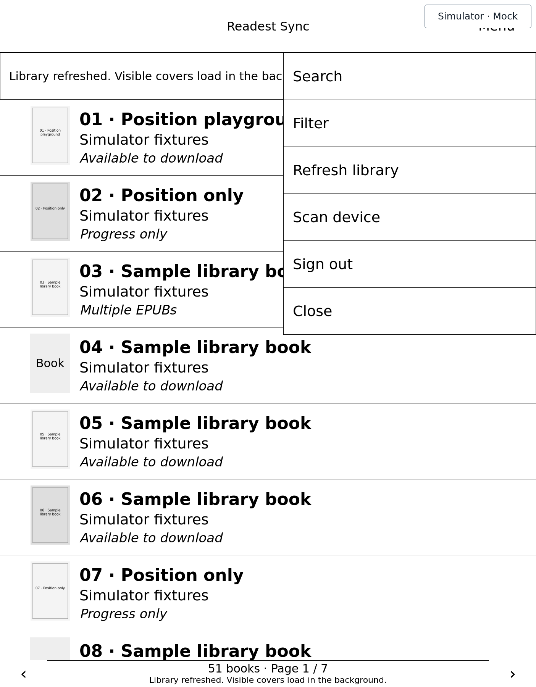
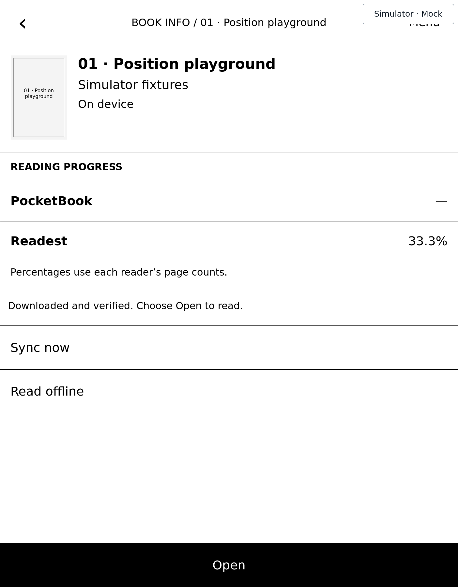
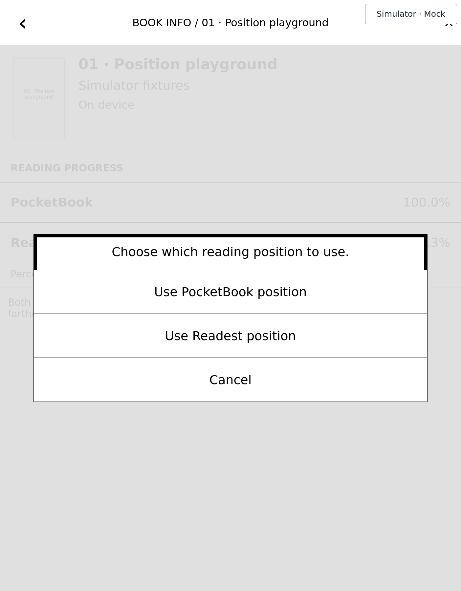
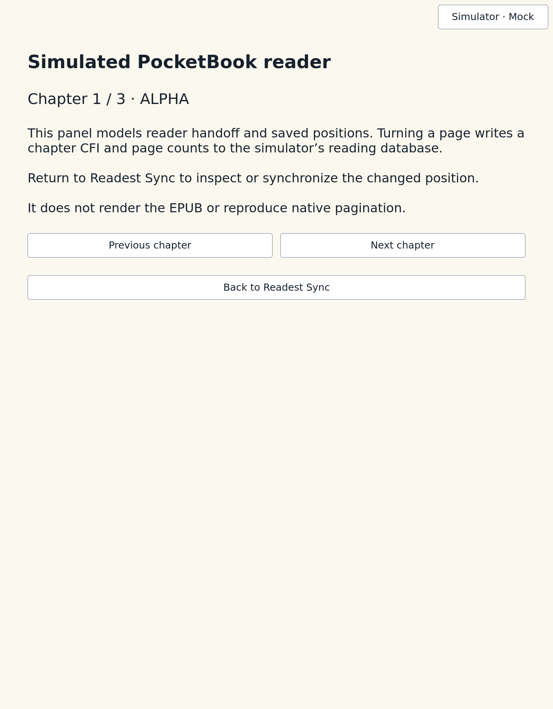

# Readest Sync user guide

Readest Sync brings DRM-free EPUBs, reading positions, highlights and attached
notes between your PocketBook and Readest. Books open in the PocketBook native
reader; Readest Sync manages transfers and synchronization.

The screenshots below show the current app in **Mock cloud** simulator mode with
synthetic books. They are not device screenshots. The app has been validated on
InkPad 4 (PB743G), firmware `U743g.6.11.1683`; other devices need separate testing.

## Start with your library

Follow the [installation instructions](../release/README.md), then launch
**Readest Sync** from Applications. Sign in with your Readest email and password
and choose **Menu → Refresh library**.

The library combines Readest entries with EPUBs known to the PocketBook library.
Startup loads cached cloud information and scans the native library index without
requesting Wi-Fi. You can browse local books while signed out.

Tap a row to open its book details. Use the footer arrows or hardware page keys
to browse pages. Covers load as you browse; books without a cover use a placeholder.

## Search, filter and refresh

Open **Menu** using the header button or a short press of the hardware Menu key,
where available. The same availability rules apply to both controls; the menu
stays closed while an operation or a conflict choice requires your attention.

| Action | What it does |
| --- | --- |
| Search | Matches titles and authors. |
| Filter | Shows all books, books available to download, books on device, progress-only entries or PocketBook-only books. |
| Refresh library | Fetches current Readest metadata and availability and refreshes the local inventory. |
| Scan device | Refreshes EPUBs from the PocketBook library index. It does not recursively scan every folder. |
| Sign out | Removes the saved session and retains local EPUBs. |

Search and filters work together. If a newly copied EPUB is missing, let the
PocketBook library discover it, then choose **Scan device**.

## Download, upload and read

For a cloud book, choose **Download EPUB** in its details. Readest must hold the
original EPUB; an entry with reading progress alone cannot be downloaded. The app
validates the EPUB before installing it under `Books/Readest`.

Available actions depend on the book's state:

| Action | What it does |
| --- | --- |
| Open | Synchronizes the linked book and opens the native reader. A pending incoming position changes the label to **Open at Readest position**. |
| Sync now | Synchronizes reading progress and supported annotations for this book. An incoming reading position is staged until you choose Open. |
| Read offline | Opens the local EPUB using its existing native position, without contacting Readest. |
| Upload to Readest / Upload EPUB to Readest | Uploads a local EPUB when the corresponding action is offered. |
| Re-upload to Readest | Explicitly restores a book removed from Readest. |

Local books remain at their original paths. Refresh, sign-out and cloud book
removal do not delete local EPUBs. A removed cloud book with a local copy remains
available offline.

After reading, return to Readest Sync and choose **Sync now** to send your latest
position and annotations. If a new book has no native reading settings, open and
close it once before syncing. The percentages in details can differ because the
two readers paginate differently; the app synchronizes the passage location.

## Choose a reading position

If both reading positions changed, the app asks which one to use. Check the
PocketBook and Readest values in the book details before choosing.

- **Use PocketBook position** chooses the local reading position for synchronization.
- **Use Readest position** stages the cloud position; choose **Open at Readest position** to apply it in the native reader.
- **Cancel** leaves the choice unresolved.

Open can also offer **Open at PocketBook position** and **Open at Readest
position**, including when you explicitly want to move backward. Opening at the
PocketBook position in that choice opens locally without updating Readest. The
app rechecks positions before applying your choice and rejects stale choices.

## Synchronize highlights and notes

Create highlights and edit their attached notes in the PocketBook native reader
or in Readest. For a linked book with the matching original EPUB:

1. Finish the edit and close the reader so it saves the change.
2. Select the book in Readest Sync and choose **Sync now**, or use online **Open**.
3. Open the book in the other reader and check the highlighted passage and note.

Synchronization supports creates, edits and deletions in both directions.
Readest Sync has no annotation editor or annotation list of its own. **Refresh
library** does not synchronize annotations for every book; **Read offline** does
not contact the cloud.

Unsupported passages or annotation styles are skipped with a warning rather than
placed at an estimated location. If both readers changed the same annotation,
both versions are retained and the conflict is reported. The reading-position
choice shown above does not resolve annotation conflicts. Pending annotation
changes survive interrupted operations so a later sync can reconcile them.

## Navigation and device behavior

Back returns from book details to the library; Back from the library exits the
app. The hardware Menu key uses a short press. Key availability depends on the
device; a long press can invoke a firmware action instead.

Automatic G-sensor rotation outside the native reader remains an
[open device limitation](https://github.com/42lizard/pocketbook/issues/25).
The simulator supports both portrait and landscape layouts. Its rendering does
not reproduce e-ink refresh timing or prove behavior on other firmware.

## Try it without an account

Start the [PocketBook simulator](../../../tools/pocketbook-simulator/README.md)
and choose **Mock cloud**. Its synthetic library includes downloadable books,
progress-only entries and transfer faults. The mock reader lets you exercise
handoff and reading-position changes:

This panel is a simulator aid, not the PocketBook reader. It does not render EPUBs
or provide an annotation editor. Follow the
[mock scenarios and screenshot instructions](../../../tools/pocketbook-simulator/apps/readest-sync/README.md)
to reproduce the workflows.

These five unmodified screenshots were captured on 2026-09-26 from the app at
`e0fd528`, using the simulator integration test with `READEST_DOC_SCREENSHOTS` and
an isolated temporary mock profile. No real account or library data is included.

For storage, diagnostics, architecture and test commands, see the
[technical README](../README.md).
